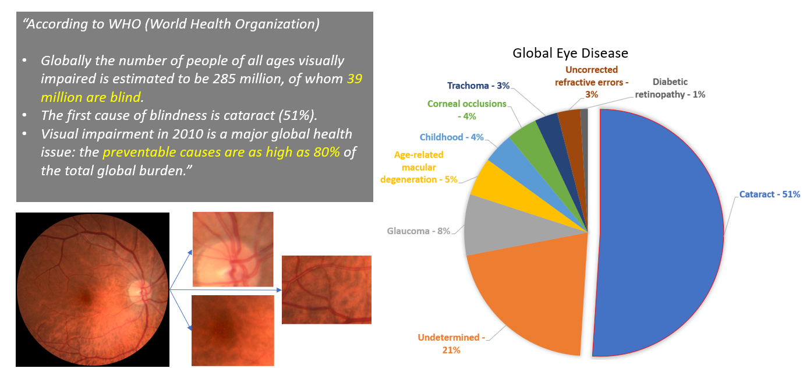
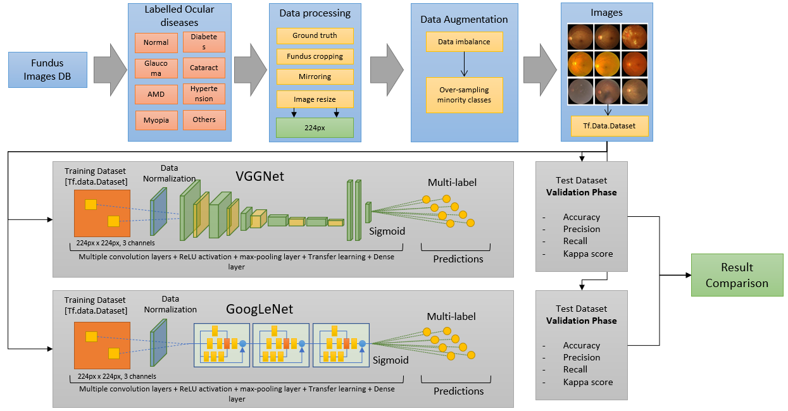
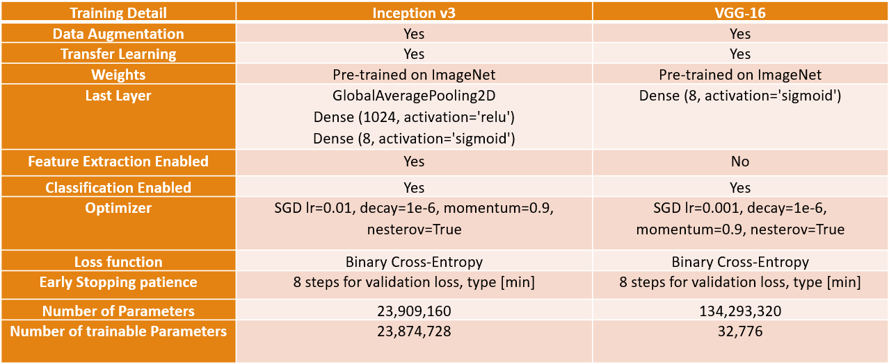
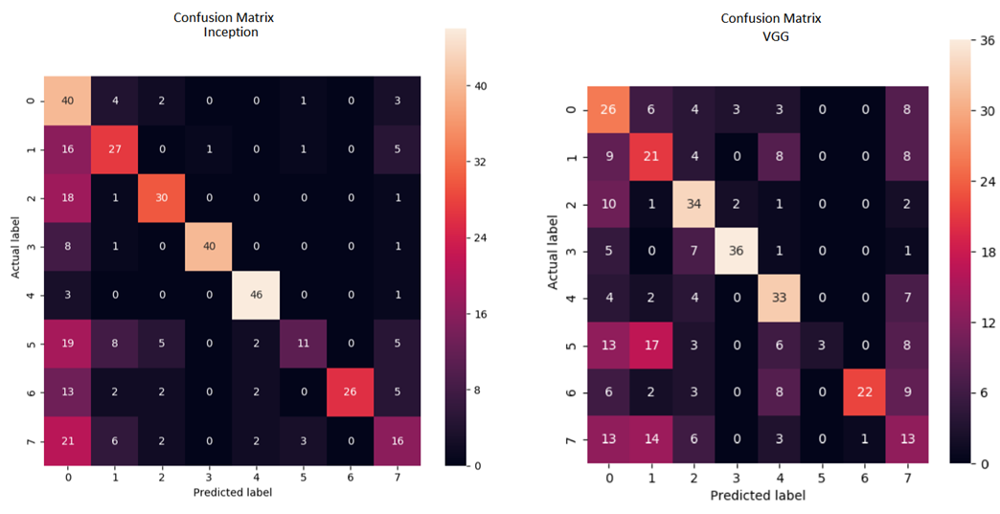
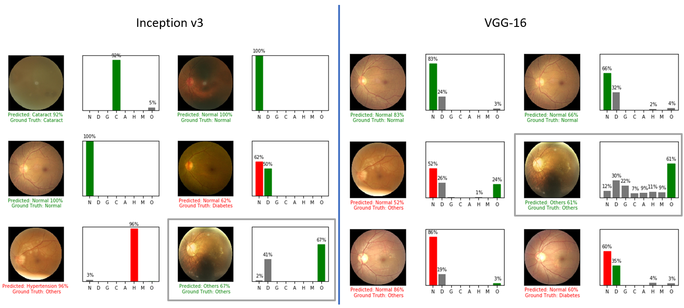
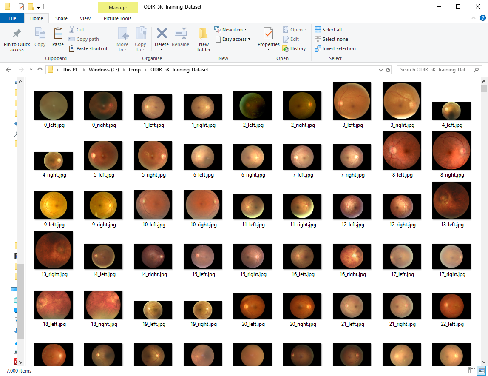
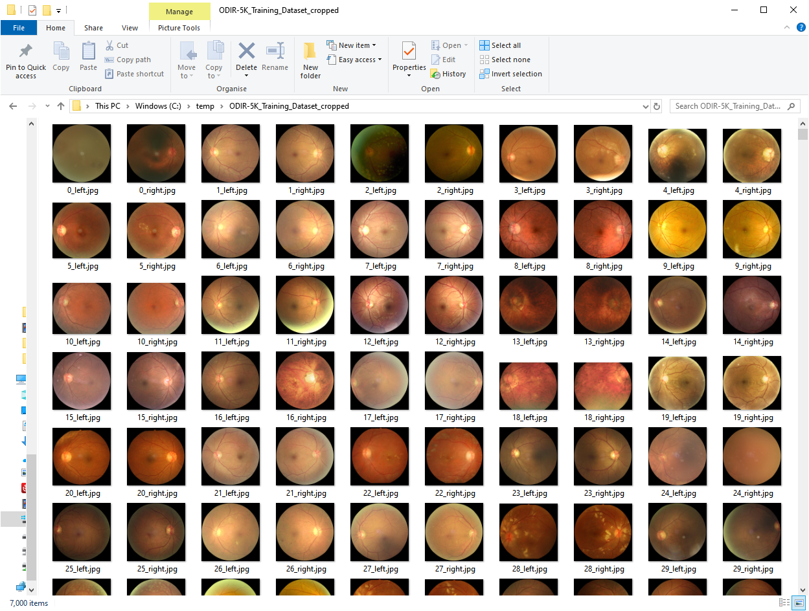
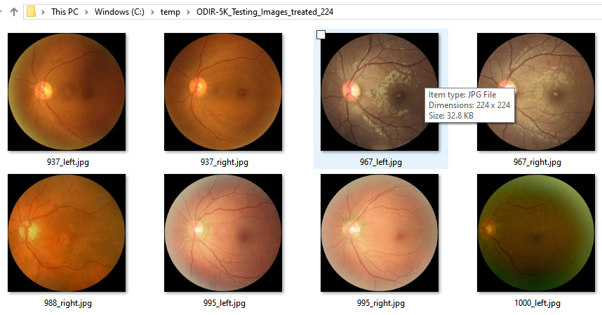

# Ocular Disease Intelligent Recognition Through Deep Learning Architectures

<p align="justify">This repository contains Jordi Corbilla's Msc dissertation: <br>
  - <b>Ocular Disease Intelligent recognition through deep learning architectures</b>, published by Universitat Oberta de Catalunya in 2020 [http://openaccess.uoc.edu/webapps/o2/handle/10609/113126].
<br>  The dissertation PDFs and the dissertation sources are licensed under the <b>Creative Commons Attribution</b> license, as described in the LICENSE file.</p>

## Abstract

<p align="justify">Retinal pathologies are the most common cause of childhood blindness worldwide. Rapid and automatic detection of diseases is critical and urgent in reducing the ophthalmologist's workload. Ophthalmologists diagnose diseases based on pattern recognition through direct or indirect visualization of the eye and its surrounding structures. Dependence on the fundus of the eye and its analysis make the field of ophthalmology perfectly suited to benefit from deep learning algorithms. Each disease has different stages of severity that can be deduced by verifying the existence of specific lesions and each lesion is characterized by certain morphological features where several lesions of different pathologies have similar characteristics. We note that patients may be simultaneously affected by various pathologies, and consequently, the detection of eye diseases has a multi-label classification with a complex resolution principle.</p>
<p></p>
<p align="justify">Two deep learning solutions are being studied for the automatic detection of multiple eye diseases. The solutions chosen are due to their higher performance and final score in the ILSVRC challenge: GoogLeNet and VGGNet. First, we study the different characteristics of lesions and define the fundamental steps of data processing. We then identify the software and hardware needed to execute deep learning solutions. Finally, we investigate the principles of experimentation involved in evaluating the various methods, the public database used for the training and validation phases, and report the final detection accuracy with other important metrics.</p>

## Keywords

Image classification, Deep learning, Retinography, Convolutional neural networks, Eye diseases, Medical imaging analysis.

## Pathologies



<p align="justify">According to 2010 World Health Organization data: The prevalence of preventable blindness is staggering, with over 39 million people affected globally, 80% of whom could have been prevented. In developing countries, cataracts remain the leading cause of blindness, accounting for 51% of cases worldwide.</p>

<p align="justify">Currently, the standard method for classifying diseases based on fundus photography involves manual estimation of injury locations and analysis of their severity, which is time-consuming and costly for ophthalmologists and healthcare systems. Therefore, there is a pressing need for automated methods to streamline this process.</p>

<p align="justify">Rapid and accurate disease detection is crucial for reducing the workload of ophthalmologists and ensuring timely treatment for patients.</p>

## Deep learning architecture



**What is our methodology?**

<p align="justify">Our methodology consists of several steps that enable us to accurately classify medical images into different pathologies. First, we carefully analyze the dataset to ensure that each pathology is correctly represented. Next, we develop algorithms for processing the images, which are then fed into deep learning networks capable of handling them. To address imbalances in the data, we include a data augmentation module that adds variability to the images.</p>

<p align="justify">Using these data vectors, we train multiple deep learning models through a series of experiments, each aimed at improving classification accuracy. We adjust the size of the images and conversion blocks to optimize performance, while convolutional layers extract relevant image features and reduce dimensionality. The final decision-making step is handled by a Sigmoid layer.</p>

<p align="justify">In the end, we generate and compare results from each experiment to determine the best-performing model. To illustrate our methodology, we have created a flowchart that details each stage of the process.</p>

## Training Details



<p align="justify">After introducing the models and performing hundreds of experiments with them, we can talk about the best experiment found for each model and their configuration.</p>

<p align="justify">For the <b>Inception</b> model, we used data augmentation, loading the model with ImageNet weights, thus enabling transferred learning. Each model has two main components, one for the feature extraction and the other for the sorting. In this experiment, we enabled both components because the results obtained with this configuration were very satisfactory. As discussed earlier, the last layer has been modified to add a dense layer with a Sigmoid activation that allows us to calculate the loss for each of the 8 classes in the output. We also use a Stochastick Gradient Descent with a learning rate of 0.01. The loss function is of the binary cross entropy type due to the multi-tag configuration and we also add a patience feature that will stop the training if the validation loss does not decrease for 8 stages. The number of parameters we can train is of 23 million.</p>

<p align="justify">As far as the <b>VGG</b> model is concerned, we have noticed that transfer learning does better than training the model as a whole. Therefore, we loaded the weights of ImageNet and modified the last layer to consider the multi-label problem and only enabled the part of the classifier leaving us with only 32 thousand parameters to train. The only difference here with the Inception model is that the learning rate is 0.001 and the rest is configured in the same way.</p>

## Model Comparison


<p align="justify">The final score of the models shows us a clear winner with 60% accuracy and a 55% of Recall with the Inception model. Giving you a final score of 76% (taking into account the mean value of the sum of the values of the Kappa coefficient of Cohen, F1-Score and AUC).</p>
<p align="justify">As for the VGG model, it is very close to the result of the Inception but has an accuracy of 57% with a recall of 36%, indicating that 36% of the returned values are correct with respect to the total number of images that are right.
For better visual representation, we can use the confusion matrix below.</p>

## Confusion matrix



<p align="justify">As we can see in these confusion matrices. Inception does a better job of sorting items on the diagonal of the array, indicating the correct classification. If we had a perfect matrix, we would have to see number 50 in each cell on the diagonal. Therefore we have classifications with 80% of successes and others like for example the hypertension named with a 5 where we have only been able to correctly classify 22%. We have more than 50% of correct classifications in each class except hypertension and other pathologies with 22% and 32% respectively. However, despite the increase in data (through data augmentation), there are still features that have not been learned by the model.</p>

<p align="justify">As for the VGG, we can see how the data is a bit more scattered but we also have different classifications on the diagonal. As for the minority hypertension class, we can also see that there was an issue here as it was unable to classify too many images in this category.</p>

## Classification Output



<p align="justify">Finally we can see the output that each model generates and where we can visually check the classification result towards its ground truth. With this work, all the code related to the training and validation of the data, as well as the inference check to validate the output of the models, are delivered in this repo.</p>

<p align="justify">We can see, then, that the two models have the same classification for the same image, but if we analyze in detail the response of each output we can see that it is quite different.</p>

## Conclusions

- This project studies two deep learning models for the multiple classification of diseases.
- There is added complexity due to the multi-label and the initial data imbalance.
- We have seen that after the fine-tuning of the experiments we are able to obtain 60% accuracy on the validation set.
- The scenario is set for future applications, where the model could support the ophthalmologist during the capture of the fundus, and thus to classify pathologies faster.

## Implementation Details

### Dataset

The Dataset is part of the ODIR 2019 Grand Challenge. In order to use the data you need to register and download it from there: <https://odir2019.grand-challenge.org/introduction/>

### Works on Python 3.6

[tensorflow-2.0](https://github.com/tensorflow/tensorflow) - use branch `master`

The full list of packages used can be seen below:

```python
- tensorboard-2.0.0
- tensorflow-2.0.0
- tensorflow-estimator-2.0.1
- tensorflow-gpu-2.0
- matplotlib-3.1.1
- keras-applications-1.0.8
- keras-preprocessing-1.0.5
- opencv-python-4.1.1.26
- django-2.2.6
- image-1.5.27
- pillow-6.2.0
- sqlparse-0.3.0
- IPython-7.8.0
- keras-2.3.1
- scikit-learn-0.21.3
- pydot-1.4.1
- graphviz-0.13.2
- pylint-2.4.4
- imbalanced-learn-0.5.0
- seaborn-0.9.0
- scikit-image-0.16.2
- pandas-0.25.1
- numpy 1.17.2
- scipy-1.3.1
```

All the training images must be in JPEG format and with 224x224px.

### Usage

#### 1) Image Treatment Process

Place all the files in the following folders (Training and Validation images):

```cmd
c:\temp\ODIR-5K_Training_Dataset
c:\temp\ODIR-5K_Testing_Images
```

The training images Dataset should contain 7000 images and the testing Dataset 1000 images. Below is a screenshot of the images in the training dataset folder:



Then, create the following folders:

```cmd
c:\temp\ODIR-5K_Testing_Images_cropped
c:\temp\ODIR-5K_Testing_Images_treated_128
c:\temp\ODIR-5K_Testing_Images_treated_224
c:\temp\ODIR-5K_Training_Dataset_cropped
c:\temp\ODIR-5K_Training_Dataset_treated_128
c:\temp\ODIR-5K_Training_Dataset_treated_224
c:\temp\ODIR-5K_Training_Dataset_augmented_128
c:\temp\ODIR-5K_Training_Dataset_augmented_224
```

run the following command to treat the training and validation images:

```cmd
//These two remove the black pixels
python odir_image_crop_job.py
python odir_image_testing_crop_job.py

//These two resize the images to 224 pixels
python odir_training_image_treatment_job.py
python odir_testing_image_treatment_job.py
```

The odir_image_crop_job.py job will treat all the Training Dataset images and remove the black area of the images so the images end up like in the image below (same job for the odir_image_testing_crop_job.py which will act upon the training images):



The second job will perform the resize and squaring functionality to 224 pixels x 224 pixels. The parameters image_width and keep_aspect_ratio variables can be edited in the python file to test different values/scenarios. This should give you images like the ones below:



#### 2) Data Augmentation (if you don't want to use this step you can skip it)

run the following command to generate the additional images:

```cmd
python.exe odir_data_augmentation_runner.py
```

This will generate the **odir_augmented.csv** file.

#### 3) Image to tf.Data conversion and .npy storage

Now that we have all the images. We need to translate them into a td.Data component so we can load them into our model. Run the following command to generate the dataset for training and validation:

```cmd
python.exe odir_patients_to_numpy.py
```

Note that any changes in the images will need a re-run of this script to rebuild the .npy files.

If you take a look at the arguments of the script you will see the following:

```python
image_width = 224
training_path = r'C:\temp\ODIR-5K_Training_Dataset_treated' + '_' + str(image_width)
testing_path = r'C:\temp\ODIR-5K_Testing_Images_treated' + '_' + str(image_width)
augmented_path = r'C:\temp\ODIR-5K_Training_Dataset_augmented' + '_' + str(image_width)
csv_file = r'ground_truth\odir.csv'
csv_augmented_file = r'ground_truth\odir_augmented.csv'
training_file = r'ground_truth\testing_default_value.csv'
```

**odir.csv** file contains the generated ground truth per eye. To generate the ground truth, you can take a look at odir_runner.py which contains the different procedures to generate the ground truth based on the ODIR-5K_Training_Annotations(Updated)_V2.xlsx file which is part of the provided file by ODIR.

**odir_augmented.csv** contains the generated ground truth per eye and sample of the data augmentation process generator. This makes things easier when trying to feed this into the model and compare the results.

**testing_default_value.csv** contains the vectors of the testing images.

### Deep Learning Models

#### 4) Run Inception-v3

```cmd
-- Basic Run of the model
python.exe odir_inception_v3_training_basic.py
```

Sample output can be seen here: [readme.md](https://github.com/JordiCorbilla/ocular-disease-intelligent-recognition-deep-learning/blob/master/output/inception_basic/readme.md)

```cmd
-- Enhanced Run of the model using Data Augmentation
python.exe odir_inception_training.py
```

Sample output can be seen here: [readme.md](https://github.com/JordiCorbilla/ocular-disease-intelligent-recognition-deep-learning/blob/master/output/inception_advanced/readme.md)

#### 4.1) Inception Inference

```cmd
python.exe odir_inception_testing_inference.py
```

#### 5) Run VGG16

```cmd
-- Basic Run of the model
python.exe odir_vgg16_training_basic.py
```

- Download the VGG16 ImageNet weights from here: [weights](https://github.com/fchollet/deep-learning-models/releases/download/v0.1/vgg16_weights_tf_dim_ordering_tf_kernels.h5)
- Sample output can be seen here: [readme.md](https://github.com/JordiCorbilla/ocular-disease-intelligent-recognition-deep-learning/blob/master/output/vgg16_basic/readme.md)

```cmd
-- Enhanced Run of the model using Data Augmentation
python.exe odir_vgg16_training.py
```

- Sample output can be seen here: [readme.md](https://github.com/JordiCorbilla/ocular-disease-intelligent-recognition-deep-learning/blob/master/output/vgg_advanced/readme.md)

#### 5.1) VGG16 Inference

```cmd
python.exe odir_vgg_testing_inference.py
```

### Deep Learning Models (Additional - out of the scope of this dissertation)

#### 6) Run VGG19

```cmd
-- Basic Run of the model
python.exe odir_vgg19_training_basic.py
```

- Download the VGG19 ImageNet weights from here: [weights](https://github.com/fchollet/deep-learning-models/releases/download/v0.1/vgg19_weights_tf_dim_ordering_tf_kernels.h5)
- Sample output can be seen here: [readme.md](https://github.com/JordiCorbilla/ocular-disease-intelligent-recognition-deep-learning/blob/master/output/vgg19_basic/readme.md)

```cmd
-- Enhanced Run of the model using Data Augmentation
python.exe odir_vgg19_training.py
```

- Sample output can be seen here: [readme.md](https://github.com/JordiCorbilla/ocular-disease-intelligent-recognition-deep-learning/blob/master/output/vgg19_advanced/readme.md)

#### 6.1) VGG19 Inference

```cmd
python.exe odir_vgg19_testing_inference.py
```

#### 7) Run ResNet50

```cmd
-- Basic Run of the model
python.exe odir_resnet50_training_basic.py
```

- Sample output can be seen here: [readme.md](https://github.com/JordiCorbilla/ocular-disease-intelligent-recognition-deep-learning/blob/master/output/vgg19_basic/readme.md)

```cmd
-- Enhanced Run of the model using Data Augmentation
python.exe odir_resnet50_training.py
```

- Sample output can be seen here: [readme.md](https://github.com/JordiCorbilla/ocular-disease-intelligent-recognition-deep-learning/blob/master/output/vgg19_advanced/readme.md)

#### 7.1) ResNet50 Inference

```cmd
python.exe odir_resnet50_testing_inference.py
```

#### 8) Run InceptionResNetV2

```cmd
-- Basic Run of the model
python.exe odir_inception_ResNetV2_training_basic.py
```

- Sample output can be seen here: [[readme.md]](https://github.com/JordiCorbilla/ocular-disease-intelligent-recognition-deep-learning/blob/master/output/vgg19_basic/readme.md)

```cmd
-- Enhanced Run of the model using Data Augmentation
python.exe odir_inception_ResNetV2_training.py
```

- Sample output can be seen here: [readme.md](https://github.com/JordiCorbilla/ocular-disease-intelligent-recognition-deep-learning/blob/master/output/vgg19_advanced/readme.md)

#### 8.1) ResNet50 Inference

```cmd
python.exe odir_inception_ResNetV2_testing_inference.py
```

## References

- Abadi, M., Agarwal, A., Barham, P., Brevdo, E., Chen, Z., Citro, C., Corrado, G.S., Davis, A., Dean, J., Devin, M., Ghemawat, S., Goodfellow, I., Harp, A., and, ... (2016). Tensorflow: Large-scale machine learning on heterogeneous distributed systems. arXiv preprint arXiv:1603.04467.
- Lee, M. Seattle, P. Taylor, U. Kingdom. Machine learning has arrived! Ophthalmology. (2017), pp. 1726-1728.
- Bengio, Y., Courville, A. and Vincent, P. (2013). Representation Learning: A Review and New Perspectives. IEEE Transactions on Pattern Analysis and Machine Intelligence, 35(8), pp.1798-1828.
- Bonet, E. (2018). Què és un fons d’ull? Servei d’Oftalmologia. Fundació Hospital de nens de Barcelona, p.1.
- Carletta, Jean. (1996) Assessing agreement on classification tasks: The kappa statistic. Computational Linguistics, 22(2), pp. 249–254
- C.I. Sánchez, M. Niemeijer, I. Išgum, A.V. Dumitrescu, M.S.A. Suttorp-Schulten, M.D. Abràmoff and B. van Ginneken. "Contextual computer-aided detection: Improving bright lesion detection in retinal images and coronary calcification identification in CT scans", Medical Image Analysis 2012;16(1):50-62
- C.I. Sánchez, M. Niemeijer, A.V. Dumitrescu, M.S.A. Suttorp-Schulten, M.D. Abràmoff and B. van Ginneken. "Evaluation of a Computer-Aided Diagnosis system for Diabetic Retinopathy screening on public data", Investigative Ophthalmology and Visual Science 2011;52:4866-4871.
- Fawcett, Tom (2006) "An Introduction to ROC Analysis"(PDF). Pattern Recognition Letters. 27 (8): 861–874.
- García, B., De Juana, P., Hidalgo, F and Bermejo, T. (2010). Oftalmología. Farmacia hospitalaria Tomo II. Publicado por la SEFH. Capítulo 15.
- Garrido, R. (2011). Epidemiología descriptiva del estado refractiva en estudiantes universitarios. Universidad Complutense de Madrid, p.339.
- Gilbert, C., Foster A. (2001). Childhood blindness in the context of VISION 2020 – the right sight. Bull World Health Organ, 79(3):227-32.
- Hijazi, S., Kumar, R. Rowen, C. Using Convolutional Neural Networks for Image Recognition. 2015. Cadence.
- Jaworek-Korjakowska, J., Kleczek, P., Gorgon, M. Melanoma Thickness Prediction Based on Convolutional Neural Network With VGG-19 Model Transfer Learning. (2019) The IEEE Conference on Computer Vision and Pattern Recognition (CVPR) Workshops.
- Kent, Allen; Berry, Madeline M.; Luehrs, Jr., Fred U.; Perry, J.W. (1955). "Machine literature searching VIII. Operational criteria for designing information retrieval systems". American Documentation. 6 (2): 93. doi:10.1002/asi.5090060209. arXiv preprint arXiv: 1409.4842
- Krizhevsky, A., Sutskever, I. and Hinton, G. (2017). ImageNet classification with deep convolutional neural networks. Communications of the ACM, 60(6), pp.84-90.
- Kusumoto D, Yuasa S. The application of convolutional neural network to stem cell biology. Inflamm Regen. 2019 39:14. Published 2019 Jul 5. doi:10.1186/s41232-019-0103-3.
- Lecun Y, Bengio Y, Hinton G. Deep learning. Nature. 2015;521(7553):436–444.
- Lyana N. M., & Norshahrizan, N., (2015). The Self-Driving Car.
- M.D. Abramoff, Y. Lou, A. Erginay, et al. Improved automated setection of diabetic retinopathy on a publicly available dataset through integration of deep learning Invest Ophthalmol Vis Sci. (2016), pp. 5200-5206
- Ocular Disease Intelligent Recognition. (2019). ODIR-2019 - Grand Challenge. [online] Available at: <https://odir2019.grand-challenge.org/introduction/> [Accessed 27 Sep. 2019].
- Oftalmològica. (2019). Tecnologia per a la revisió de la retina - Àrea Oftalmològica Avançada.
- Parampal S. Grewal, Faraz Oloumi, Uriel Rubin, Matthew T.S. Tennant, Deep learning in ophthalmology: a review, Canadian Journal of Ophthalmology, Volume 53, Issue 4, 2018, Pages 309-313, ISSN 0008-4182,
- Roletschek, R., (2019). [image] Available at: Fahrradtechnik auf fahrradmonteur.de [FAL or GFDL 1.2 license] [Accessed 3 Nov. 2019].
- Russakovsky, O., Deng, J., Su, H., Krause, J., Satheesh, S., Ma, S., Huang, Z., Karpathy, A., Khosla, A., Bernstein, M., Berg, A. and Fei-Fei, L. (2015). ImageNet Large Scale Visual Recognition Challenge. International Journal of Computer Vision, 115(3), pp.211-252.
- Saine, P. and Tyler, M. (2002). Ophthalmic photography. Boston [Mass.]: Butterworth-Heinemann.
- Sermanet, Pierre, David Eigen, Xiang Zhang, Michael Mathieu, Rob Fergus, and Yann LeCun. OverFeat: Integrated Recognition, Localization and Detection Using Convolutional Networks. arXiv:1312.6229 [Cs], December, 2013.
- Simonyan, K. and Zisserman, A. (2015). Very deep convolutional networks for large-scale image recognition. Published as a conference paper at ICLR 2015.
- Szegedy, C., Liu, W., Jia, Y., Sermanet, P., Reed, S., Anguelov, D., Erham, D., Vanhoucke, V., Rabinovich, A. (2014). Going Deeper with Convolutions.
- Ting DSW, Pasquale LR, Peng L, et al Artificial intelligence and deep learning in ophthalmology British Journal of Ophthalmology 2019;103:167-175.
- Tan, N. M., Liu, J., Wong, D. W. K., Lim, J. H., Li, H., Patil, S. B., Yu, W., Wong, T. Y. (2009). Automatic Detection of Left and Right Eye in Retinal Fundus Images. Springer Berlin Heidelberg. pp 610—614.
- Van Rijsbergen, C. J. (1979). Information Retrieval (2nd ed.). Butterworth-Heinemann.
- Xie, S., Girshick, R. and Dollár, P. and Tu, P. and He, K. (2016). Aggregated Residual Transformations for Deep Neural Networks. Cornell University.
- Yorston, D. (2003). Retinal Diseases and VISION 2020. Community Eye Health. 2003;16(46):19–20.
- Zhou, Y., He, X., Huang, L., Liu, L., Zhu, F., Cui, S., Shao, L. (2019). Collaborative Learning of Semi-Supervised Segmentation and Classification for Medical Images. The IEEE Conference on Computer Vision and Pattern Recognition (CVPR).

### Links to Materials

- [[vgg_model_summary.md]]
- [[generated_ground_truth.md]]
- [[inception_model_summary.md]]
- [[generated_ground_truth.md]]
- [[list_discarded_images.md]]
- [[odir_training_images_pruning.md]]
- [[configuration.md]]
- [[readme.md]]

### License

Creative Commons Attribution-NonCommercial 4.0 International Public License.

## Sponsors
No sponsors yet! Will you be the first?

[](https://www.paypal.com/paypalme/jordicorbilla)
